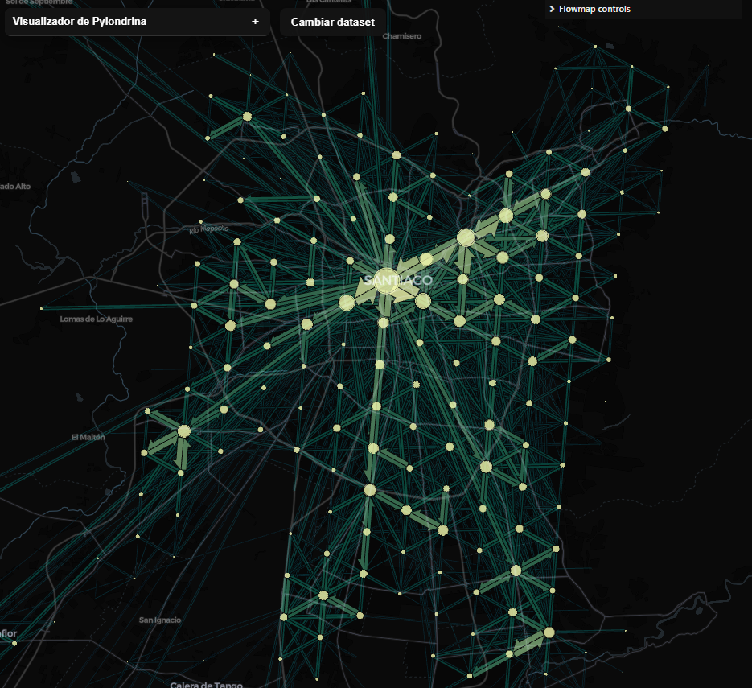
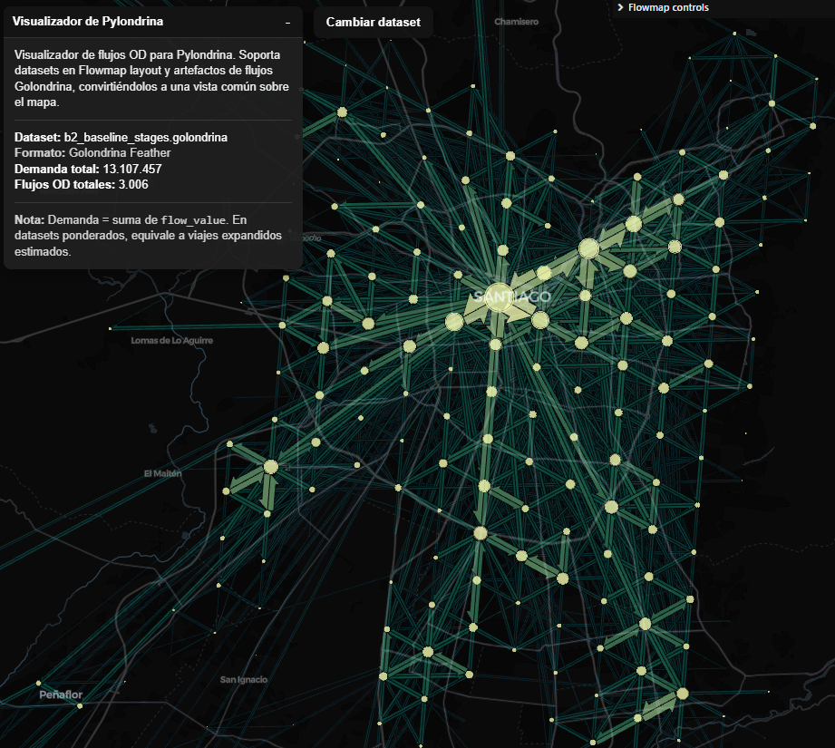
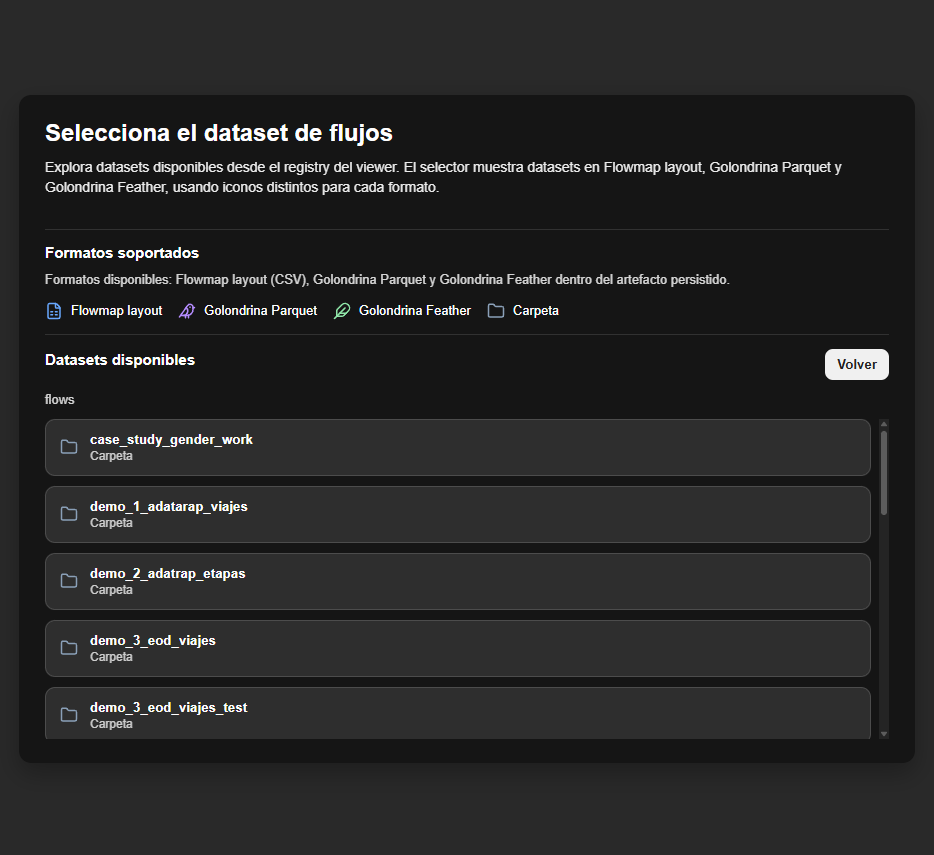
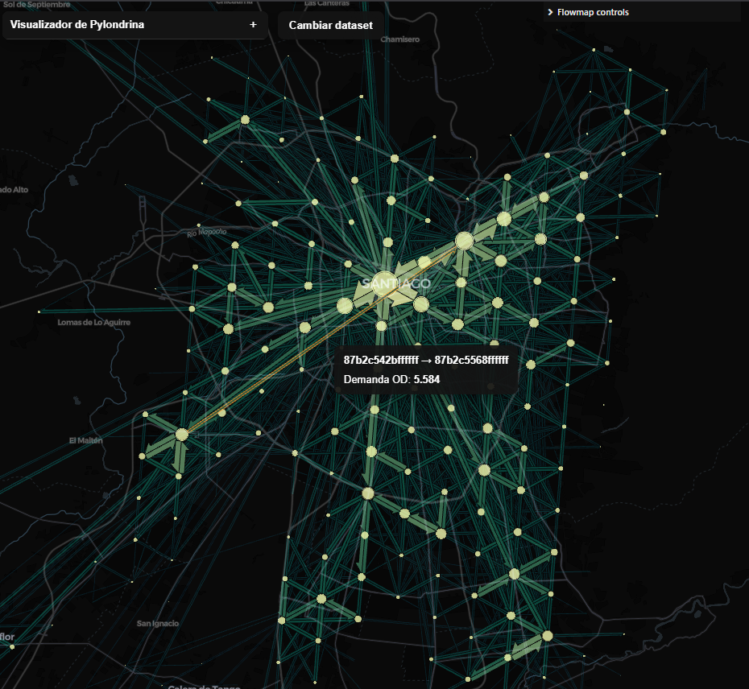
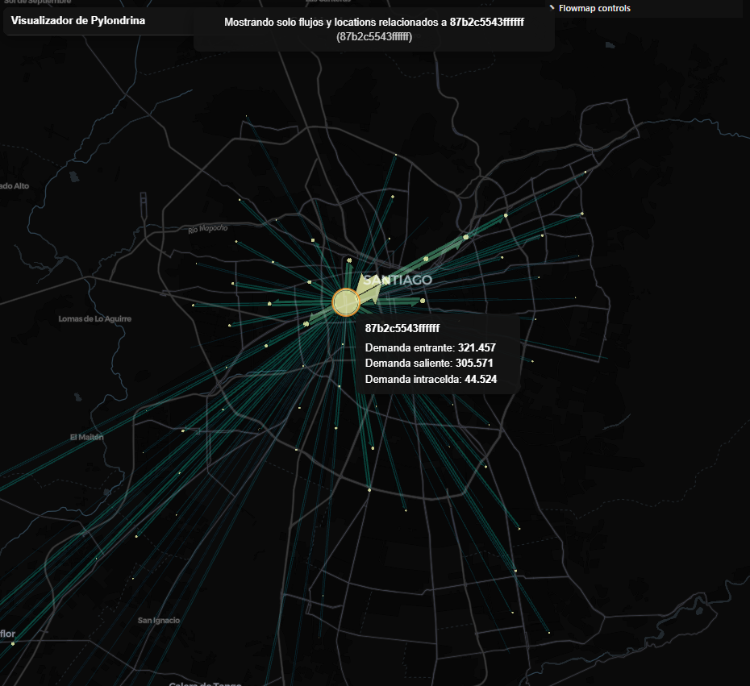
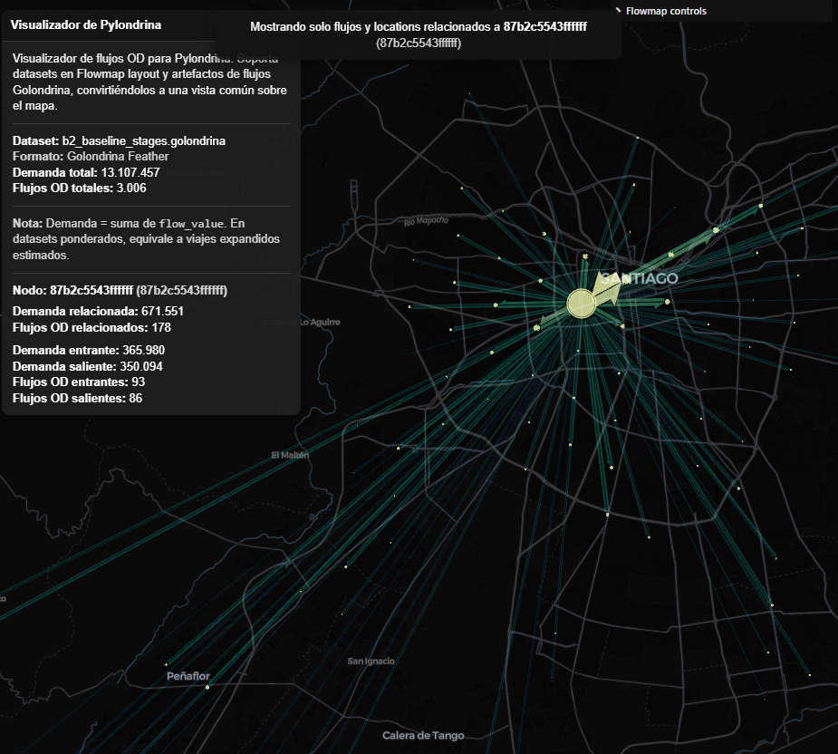
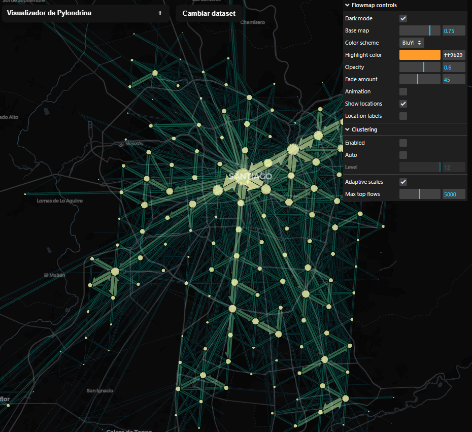

# Uso del visualizador

El visualizador de Pylondrina es un componente web auxiliar para inspeccionar flujos OD sobre un mapa interactivo. Su objetivo es facilitar la revisión visual de `FlowDataset` y de layouts exportados, no reemplazar las operaciones del core ni convertirse en una herramienta analítica completa.

La vista principal se basa en `flowmap.gl`, `deck.gl` y `MapLibre`. El viewer permite seleccionar datasets desde un registro local, cargar flujos en distintos formatos y representarlos como nodos y conexiones OD.



## Qué muestra el visualizador

La vista representa flujos origen-destino agregados.

- Un **nodo** representa una ubicación del grafo OD. En datasets Golondrina, normalmente corresponde a una celda H3.
- Un **flujo** representa una conexión OD entre un nodo de origen y un nodo de destino.
- El **grosor** y la intensidad visual del flujo reflejan la magnitud usada por la capa de visualización.
- En datasets Golondrina, la magnitud principal se construye desde `flow_value`.
- En datasets ponderados, esa magnitud puede interpretarse como demanda expandida estimada.
- La dirección se interpreta desde `origin` hacia `dest`, o desde `origin_h3_index` hacia `destination_h3_index` cuando el viewer convierte datos Golondrina.

El panel izquierdo resume el dataset cargado, su formato, la demanda total y el número de flujos OD.



## Cómo levantarlo localmente

El código fuente del viewer se desarrolla en `viewer_src/`, mientras que la build estática se genera en `viewer/`.

En modo desarrollo, desde `viewer_src/`:

```bash
yarn
yarn dev
```

Para generar la build estática:

```bash
yarn build
```

La build se genera en:

```text
viewer/
```

Para probar la build, se debe servir el repositorio desde la raíz, porque el viewer carga datasets desde rutas como `/data/flows/...`.

Desde la raíz del repositorio:

```bash
python -m http.server 8000
```

Luego se abre:

```text
http://localhost:8000/viewer/
```

!!! note "Registro de datasets"
    El viewer no explora libremente el sistema de archivos desde el navegador. Los datasets disponibles se leen desde un `viewer_registry.json`. La generación y estructura de ese registro se documenta en [Registro de datasets](data-registry.md).

## Cómo seleccionar un dataset

Al abrir el viewer, se muestra un selector de datasets. Este selector usa una estructura jerárquica de carpetas y datasets disponibles en el registro del viewer.



El selector distingue tres formatos:

| Formato | Uso |
|---|---|
| Flowmap layout | Dataset exportado como `flows.csv` y `locations.csv`. |
| Golondrina Parquet | Artefacto de flows Golondrina almacenado en Parquet. |
| Golondrina Feather | Artefacto de flows Golondrina almacenado en Feather. |

Al seleccionar un dataset, el viewer carga sus datos, transforma la información cuando corresponde y abre la vista del mapa. Para volver al selector se usa el botón **Cambiar dataset**.

## Formatos soportados

El viewer soporta dos familias de entrada.

### Flowmap layout

Corresponde al layout externo producido para visualización. El viewer espera al menos:

```text
flows.csv
locations.csv
```

En `flows.csv`, las columnas mínimas son:

```text
origin
dest
count
```

En `locations.csv`, se espera una tabla de nodos con identificador, nombre y coordenadas.

### Flujos Golondrina

El viewer también puede cargar artefactos de flows Golondrina en Parquet o Feather. En este caso, espera una tabla de flows con al menos:

```text
flow_id
origin_h3_index
destination_h3_index
flow_count
flow_value
```

Para esta ruta, el viewer construye internamente las locations a partir de los índices H3 y usa `flow_value` como magnitud visual principal. `flow_count` se conserva como conteo de registros agregados, pero no reemplaza a `flow_value` como demanda ponderada cuando esta existe.

## Tooltips de flujos

Al pasar el cursor sobre un flujo, el viewer muestra un tooltip con el par OD y la demanda asociada.



El tooltip de flujo muestra:

| Campo | Significado |
|---|---|
| Par OD | Nodo de origen y nodo de destino. |
| Demanda OD | Magnitud del flujo seleccionado. |

En datasets Golondrina, esta demanda corresponde a la magnitud visual derivada de `flow_value`.

## Tooltips de ubicaciones

Al pasar el cursor sobre un nodo, el viewer muestra un tooltip con métricas resumidas de esa ubicación.



El tooltip de ubicación muestra:

| Campo | Significado |
|---|---|
| Demanda entrante | Suma de flujos que llegan al nodo. |
| Demanda saliente | Suma de flujos que salen del nodo. |
| Demanda intracelda | Magnitud de flujos cuyo origen y destino corresponden al mismo nodo. |

Estas métricas ayudan a distinguir si una celda opera principalmente como atractora, emisora o nodo con demanda interna.

## Foco sobre un nodo

El usuario puede hacer click sobre un nodo para activar un modo de foco. En ese modo, el viewer muestra solo los flujos y nodos relacionados con la ubicación seleccionada.

Cuando hay un nodo seleccionado, el panel izquierdo agrega métricas específicas:

- demanda relacionada;
- flujos OD relacionados;
- demanda entrante;
- demanda saliente;
- flujos OD entrantes;
- flujos OD salientes.



Para salir del modo foco, se puede volver a hacer click sobre el mismo nodo.

!!! warning "Foco y clustering"
    El modo foco por nodo está implementado para clustering desactivado. Si el clustering está activo, la selección directa de locations no se usa como mecanismo principal de inspección.

## Controles disponibles

El panel derecho permite ajustar la representación visual del flowmap.



Los controles disponibles son:

| Control | Efecto |
|---|---|
| Dark mode | Cambia entre mapa base oscuro y claro. |
| Base map | Controla la opacidad del mapa base. |
| Color scheme | Cambia la paleta visual de flujos y nodos. |
| Highlight color | Define el color de resaltado al hacer hover. |
| Opacity | Ajusta la opacidad global de la capa de flujos. |
| Fade amount | Controla cuánto se atenúan elementos no destacados. |
| Animation | Activa o desactiva animación visual de flujos. |
| Show locations | Muestra u oculta los nodos. |
| Location labels | Muestra etiquetas de texto para las ubicaciones. |
| Clustering | Agrupa ubicaciones cercanas para mejorar legibilidad. |
| Adaptive scales | Ajusta escalas visuales según zoom y agregación. |
| Max top flows | Limita la cantidad máxima de flujos principales renderizados. |

Al pasar el cursor sobre las filas de control, el viewer muestra ayuda contextual breve para explicar el efecto de cada parámetro.

## Datasets segmentados

El viewer actual está pensado principalmente para flujos no segmentados. Si detecta columnas extra en la tabla de flows, interpreta que el dataset puede contener segmentación, por ejemplo por tiempo o categoría.

En ese caso, muestra una advertencia antes de continuar. El usuario puede volver al selector o continuar de todas maneras.

Si se continúa, los flujos se renderizan igualmente, pero pueden aparecer solapados o interpretarse de manera ambigua. Para análisis segmentado, se recomienda preparar previamente un subconjunto específico de flows o generar una exportación no segmentada.

## Relación con Pylondrina

El viewer es una herramienta auxiliar de inspección. La construcción, filtrado, exportación y persistencia formal de flows siguen ocurriendo en Pylondrina.

Flujo típico:

```text
TripDataset
    ↓
build_flows
    ↓
FlowDataset
    ↓
export_flows / write_flows
    ↓
viewer
```

La diferencia entre persistir, exportar y visualizar se explica en [Persistencia, exportación y visualización](../user-guide/persistence-and-viewer.md).

## Limitaciones actuales

El viewer tiene un alcance práctico y acotado:

- no reemplaza la validación ni la construcción de flows;
- no interpreta `read_flows` como certificación de conformidad;
- no explora directorios arbitrarios desde el navegador;
- depende de un `viewer_registry.json` previamente generado;
- no ofrece filtros analíticos avanzados por segmentación;
- no reconstruye relaciones `flow_to_trips`;
- no está diseñado para GPS denso ni trayectorias individuales;
- puede requerir limitar la cantidad de flujos visibles para mantener legibilidad y rendimiento.

Para operaciones específicas sobre flows, se debe consultar la sección [Operaciones Trip → Flow](../operations/flows/index.md).